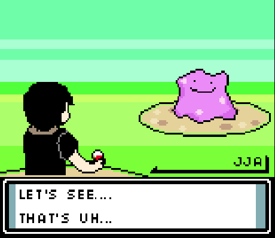

# OOD-DI-PROJECT 
  Final project for Advanced Object Oriented Design class that will demonstrate understanding of dependency injections and microservices.
  The project utilizes:
  * [Pokemon Rest API](https://pokeapi.co) <br>
  * [Docker Containers](https://www.docker.com) <br>
  * [Spring Framework](https://spring.io/projects/spring-framework)
  
  The authors are:
  * [S. Campbell](https://github.com/BlackSwan-Decoded)
  * [M. Colin](https://github.com/Marc-Colin)
  * [J. Duranceau](https://github.com/jacelynnduranceau)
  * [J. Frost](https://github.com/Frosty-Git)
  

 **Catch a random Pokemon!**
  ---
**This project will allow users to encounter a random Pokemon depending on the specified Pokemon region. <br> Upon spawning, the user will have the option to try to catch the pokemon he or she has encountered. <br> If successful that Pokemon will be saved to his or her database of pokemons (or pokedex for short)**

___

###HOW TO INSTALL AND RUN

 ####Using Maven support in IntelliJ IDEA:
- add maven framework support to the project
- run the maven command ```mvn compile jib:dockerBuild```
- run main ( the alternative is to use docker)

####Using Docker on the Command Line
  Follow these steps
- launch docker desktop app (must be previously installed)
- run this command to launch docker image ```docker run -d -p 8080:8080 --rm --name pokemoncatcher rowan.ood/pokemoncatcher```

- run this command to stop the docker image ```docker stop pokemoncatcher```
- run this command to see all docker images ```docker ps -a```

HOW TO UTILIZE SERVICE

- In the Config file located in the webapi package on line 26 change PokemonGen to the desired pokemon generation
- Open a web browser and type ```localhost:8080/pokemon``` to spawn a random pokemon
- Open a web browser and type ```localhost:8080/pokemon-id?p={id}``` where {id} (between 1 & 898) is the desired 
  pokemon's id, to spawn selected pokemon

### USER STORIES
- [X] spawn a random pokemon using dependency injection
- [ ] user can choose to catch pokemon or not
    - [ ] if user tries to catch pokemon and is successful then pokemon is persisted to database

___



